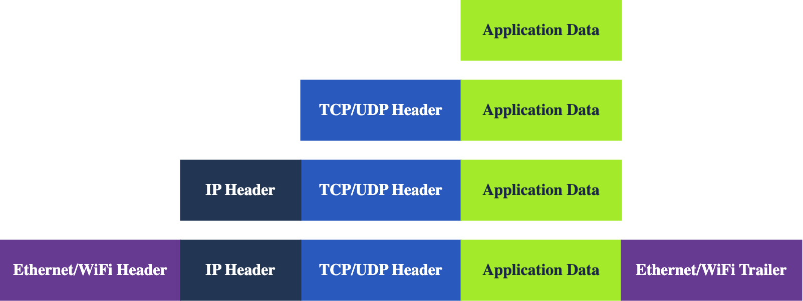

# Configuração Automática de Rede com DHCP

Você foi até sua cafeteria favorita, pegou sua bebida quente preferida e abriu seu laptop. Seu laptop conectou-se ao WiFi do estabelecimento e configurou automaticamente a rede, para que você pudesse começar a trabalhar em uma nova sala do TryHackMe. Você não digitou nenhum endereço IP, mas seu dispositivo já estava pronto para funcionar. Vamos entender como isso aconteceu.

---

## Configurações básicas necessárias para acessar uma rede

Sempre que queremos acessar uma rede, no mínimo precisamos configurar:

- **Endereço IP junto com a máscara de sub-rede**  
  _IP identifica seu dispositivo na rede; a máscara define a parte da rede e a parte do host._  
- **Roteador (ou gateway)**  
  _Dispositivo que conecta sua rede local à Internet ou a outras redes._  
- **Servidor DNS**  
  _Responsável por traduzir nomes de domínio (ex: tryhackme.com) em endereços IP que os computadores entendem._

---

## Configuração manual vs. automática

Ao conectar nosso dispositivo a uma rede nova, essas configurações precisam ser ajustadas conforme a rede. Configurar manualmente é uma boa opção, principalmente para servidores. Servidores geralmente não mudam de rede — você não carregaria um controlador de domínio e o conectaria ao WiFi da cafeteria. Além disso, outros dispositivos precisam se conectar aos servidores e esperam encontrá-los em endereços IP específicos.

---

## Vantagens da configuração automática

Ter uma forma automática de configurar dispositivos conectados traz muitas vantagens:

1. **Economiza o trabalho manual** de configurar a rede, o que é especialmente importante para dispositivos móveis.
2. **Evita conflitos de endereço IP**, ou seja, quando dois dispositivos recebem o mesmo endereço IP. Isso impediria que os dispositivos envolvidos usassem recursos da rede, tanto locais quanto da internet.

---

## DHCP: Dynamic Host Configuration Protocol

A solução para essa configuração automática é o DHCP (Protocolo de Configuração Dinâmica de Hosts). 

- DHCP é um protocolo de nível de aplicação que funciona sobre UDP.
- O servidor DHCP escuta na porta UDP 67.
- O cliente DHCP envia mensagens da porta UDP 68.
- Seu smartphone e laptop normalmente já vêm configurados para usar DHCP por padrão.

---

### Comentários adicionais

Esse protocolo é fundamental para o funcionamento simples e eficiente das redes atuais, principalmente em ambientes onde dispositivos se conectam e desconectam com frequência, como cafés, aeroportos e redes domésticas. Sem o DHCP, você teria que configurar manualmente os dados da rede em cada dispositivo que usasse, o que é impraticável e sujeito a erros.

## Processo DORA do DHCP

O protocolo DHCP segue quatro etapas principais conhecidas pela sigla **DORA** (Discover, Offer, Request, Acknowledge). Sempre que você se conecta a uma nova rede, seu computador (dispositivo) faz o processo DORA para obter um IP válido para aquela rede específica. Além disso, mesmo dentro da mesma rede, seu computador pode solicitar um novo IP se o IP anterior expirou (o "aluguel" venceu – chamado lease time), a rede foi reiniciada ou se você desligou e ligou o Wi-Fi/manualmente renovou o IP.

- **DHCP Discover**  
  O cliente envia uma mensagem **DHCPDISCOVER** em broadcast (para todos na rede), procurando por um servidor DHCP (pode ser um roteador, por exemplo).  
  _→ O cliente ainda não tem IP, então precisa "gritar" na rede pedindo ajuda._

- **DHCP Offer**  
  O servidor DHCP responde com uma mensagem **DHCPOFFER**, oferecendo um endereço IP disponível.  
  _→ O servidor diz: “Ei, você pode usar este IP aqui!”. Também informa máscara, gateway e DNS._

- **DHCP Request**  
  O cliente envia uma mensagem **DHCPREQUEST** de volta, dizendo que aceita o IP oferecido.  
  _→ Como se dissesse: “Beleza, eu aceito esse IP que você me ofereceu.”_

- **DHCP Acknowledge**  
  O servidor confirma a alocação com uma mensagem **DHCPACK**.  
  _→ “Confirmado! Esse IP agora é seu, pode usar.”_

> ✅ Esse processo evita conflitos e torna a conexão automática e eficiente, principalmente para dispositivos móveis.

## 🧪 Exemplo de Captura de Pacotes DHCP (DORA)

O trecho abaixo mostra uma captura de pacotes ilustrando os quatro passos do processo DORA. Neste exemplo, o cliente recebe o endereço IP `192.168.66.133`.

user@TryHackMe$ tshark -r DHCP-G5000.pcap -n
1 0.000000 0.0.0.0 → 255.255.255.255 DHCP 342 DHCP Discover - Transaction ID 0xfb92d53f
2 0.013904 192.168.66.1 → 192.168.66.133 DHCP 376 DHCP Offer - Transaction ID 0xfb92d53f
3 4.115318 0.0.0.0 → 255.255.255.255 DHCP 342 DHCP Request - Transaction ID 0xfb92d53f
4 4.228117 192.168.66.1 → 192.168.66.133 DHCP 376 DHCP ACK - Transaction ID 0xfb92d53f

### 🧠 Análise da Troca de Pacotes

- O cliente **ainda não tem nenhuma configuração de IP** quando começa o processo. Ele só possui o **endereço MAC**.
- Nos pacotes **1 (DHCP Discover)** e **3 (DHCP Request)**, o cliente envia pacotes do IP `0.0.0.0` para `255.255.255.255`, ou seja, **broadcast** (transmissão para todos na rede), já que ainda não tem IP.
- No nível da camada de enlace (Ethernet), ele também envia para o **endereço MAC de broadcast**: `ff:ff:ff:ff:ff:ff`. (Esse detalhe não aparece na saída do `tshark`, mas é conhecido pelo funcionamento do protocolo).
- O servidor DHCP (neste caso, `192.168.66.1`) **responde com uma oferta de IP** (`DHCP Offer`) e depois **confirma com o DHCP ACK**.
- O servidor envia a oferta usando o endereço MAC do cliente como destino.

### 📦 Resultado do Processo DHCP

Ao final do processo, o dispositivo cliente (computador) terá recebido:

- ✅ Um **endereço IP alocado** (lease) para acessar os recursos da rede.
- ✅ O **gateway (roteador)** para enviar pacotes para fora da rede local.
- ✅ Um **servidor DNS** para resolver nomes de domínio como `google.com`.

Essas configurações permitem que o dispositivo acesse **a rede local** e também **a Internet**, se disponível.

