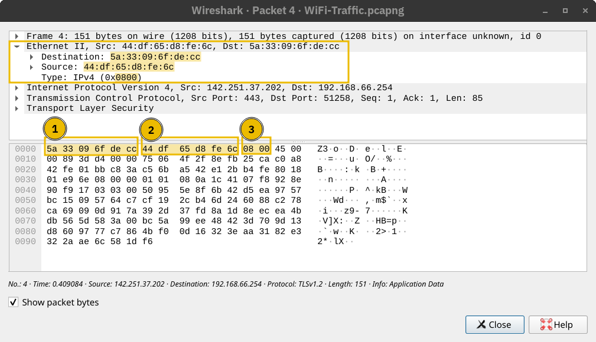

# ARP – Address Resolution Protocol

No módulo sobre **Conceitos de Rede** vimos que, ao se comunicarem em uma rede, dois hosts transmitem pacotes IP encapsulados dentro de quadros da camada de enlace (Layer 2), ou seja, o pacote IP (da camada de rede) precisa ser "embrulhado" em um quadro apropriado para o tipo de rede utilizada — como **Ethernet (IEEE 802.3)** ou **WiFi (IEEE 802.11)**.

Sempre que um host precisa se comunicar com outro **na mesma rede local (LAN)**, ele deve **enviar o pacote IP dentro de um quadro Ethernet ou WiFi**. Mesmo conhecendo o **endereço IP** do host de destino, ele ainda precisa descobrir o **endereço MAC** desse host para poder montar corretamente o cabeçalho do quadro da camada de enlace.

---

## 📌 O que é um endereço MAC?

Um **endereço MAC** é um número de 48 bits (geralmente representado em **notação hexadecimal**) e serve para identificar **dispositivos físicos** em uma rede local. Exemplos reais:

* `7C:DF:A1:D3:8C:5C`
* `44:DF:65:D8:FE:6C`

Cada dispositivo de rede (como computadores, roteadores e impressoras) possui um endereço MAC **único**, que vem gravado na placa de rede.

---

## 🔁 MACs só são usados durante a comunicação

Os dispositivos em uma rede Ethernet **não precisam conhecer os MACs uns dos outros o tempo todo**. Eles só precisam desses dados **no momento da comunicação**. Toda a lógica de comunicação gira em torno dos **endereços IP**.

---

### 💡 Exemplo:

Você conecta seu dispositivo à rede de uma cafeteria. Se houver um **servidor DHCP**, ele atribui ao seu dispositivo:

* Um IP válido _(endereço lógico único dentro da rede local)_
* A máscara de sub-rede _(define qual parte do IP representa a rede e qual representa os hosts)_
* O endereço IP do roteador (gateway) _(usado para enviar pacotes para fora da rede local)_
* O IP do servidor DNS _(responsável por traduzir nomes de domínios para endereços IP)_

Com isso, seu computador **conhece o IP do roteador** (para sair pra Internet) e o **IP do servidor DNS** (para resolver domínios). Até aqui, **nenhum endereço MAC foi revelado**.

No entanto, se você for **enviar um pacote diretamente a outro dispositivo na mesma rede**, **os MACs precisam ser descobertos**.

---

### 📦 Exemplo de um quadro Ethernet

Na captura abaixo, podemos ver **um pacote IP encapsulado em um quadro Ethernet**.

O **cabeçalho do quadro Ethernet** contém:

* **MAC de destino** – para onde o pacote deve ir dentro da rede local
* **MAC de origem** – quem está enviando o pacote
* **Tipo** – por exemplo, `0x0800` representa IPv4

---

### 🧠 Resumo:

Quando um dispositivo quer mandar um pacote para outro **dentro da mesma rede local**, ele precisa saber **o endereço MAC do destino**, mesmo que já saiba o IP. Para isso, usamos o protocolo ARP — que veremos logo em seguida.

## Protocolo de Resolução de Endereço (ARP)

O **Address Resolution Protocol (ARP)** permite descobrir o endereço MAC de outro dispositivo em uma rede Ethernet. No exemplo abaixo, um host com o endereço IP `192.168.66.89` deseja se comunicar com outro sistema com o IP `192.168.66.1`.

Ele envia uma requisição ARP (**ARP Request**) perguntando qual dispositivo possui o IP `192.168.66.1`. Essa requisição é enviada do endereço MAC do solicitante para o endereço MAC de broadcast `ff:ff:ff:ff:ff:ff` (ou seja, para todos os dispositivos na rede), como mostrado no primeiro pacote.

Logo em seguida, o host com o IP `192.168.66.1` responde com seu endereço MAC, por meio de uma resposta ARP (**ARP Reply**). A partir desse momento, os dois hosts podem trocar quadros na camada de enlace (Layer 2) diretamente.

### Terminal
user@TryHackMe$ tshark -r arp.pcapng -Nn  
1 0.000000000 cc:5e:f8:02:21:a7 → ff:ff:ff:ff:ff:ff ARP 42 Who has 192.168.66.1? Tell 192.168.66.89  
2 0.003566632 44:df:65:d8:fe:6c → cc:5e:f8:02:21:a7 ARP 42 192.168.66.1 is at 44:df:65:d8:fe:6c  

Se usarmos o `tcpdump`, os pacotes serão exibidos de forma diferente. Ele usa os termos ARP Request e ARP Reply de maneira mais explícita. Veja o exemplo abaixo.

### Terminal
user@TryHackMe$ tcpdump -r arp.pcapng -n -v 
17:23:44.506615 ARP, Ethernet (len 6), IPv4 (len 4), Request who-has 192.168.66.1 tell 192.168.66.89, length 28  
17:23:44.510182 ARP, Ethernet (len 6), IPv4 (len 4), Reply 192.168.66.1 is-at 44:df:65:d8:fe:6c, length 28 

> 🔎 **Observação importante:** Um ARP Request ou ARP Reply **não é encapsulado em um pacote UDP nem IP**. Ele é encapsulado **diretamente dentro de um quadro Ethernet** (ou seja, atua puramente na camada de enlace — Layer 2).

