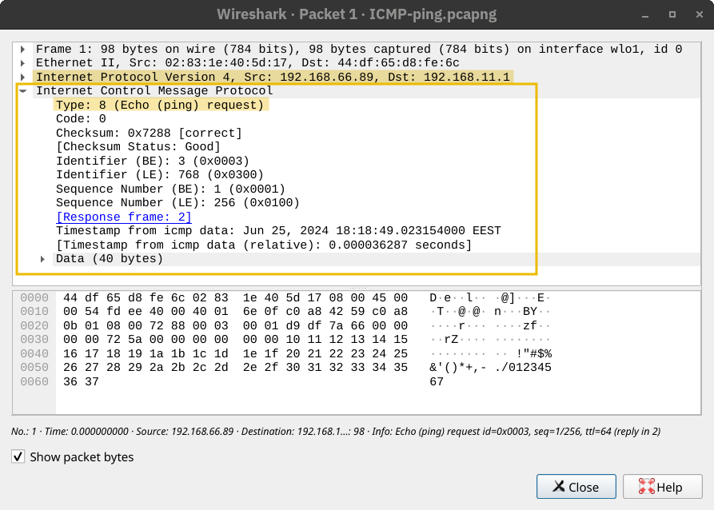

## Protocolo ICMP

O **ICMP (Internet Control Message Protocol)** é usado principalmente para **diagnósticos de rede** e **relatórios de erro**. Dois comandos muito populares dependem do ICMP e são extremamente úteis tanto para a **resolução de problemas de rede** quanto para a **segurança de redes**. Esses comandos são:

- **ping**: Esse comando usa o ICMP para testar a conectividade com um sistema de destino e medir o tempo de ida e volta (**RTT – Round-Trip Time**). Em outras palavras, pode ser usado para verificar se o destino está ativo e se a resposta dele consegue alcançar o nosso sistema.

- **traceroute**: Esse comando se chama `traceroute` em sistemas Linux e Unix-like, e `tracert` em sistemas Microsoft Windows. Ele utiliza ICMP para descobrir o **caminho que os pacotes percorrem** do seu host até o destino.

---

## Ping

Você pode nunca ter jogado ping-pong antes (tênis de mesa); no entanto, graças ao ICMP, agora você pode jogar com o computador! O comando `ping` envia uma **ICMP Echo Request** (**ICMP Tipo 8**).

A imagem abaixo mostra a mensagem ICMP encapsulada dentro de um pacote IP.

