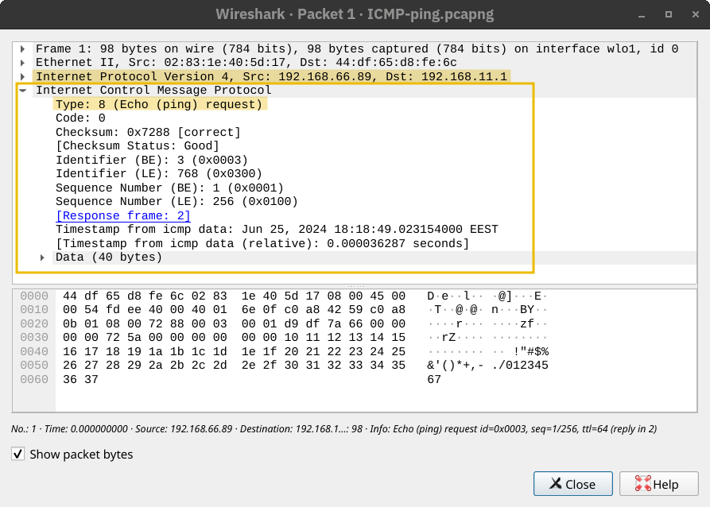
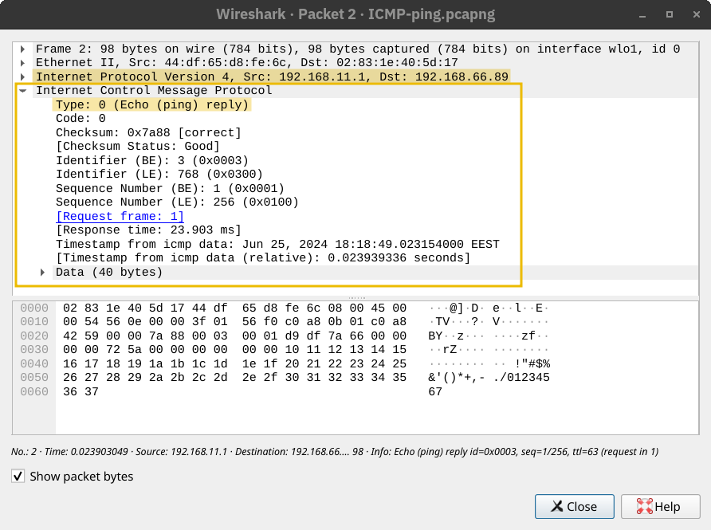

## Protocolo ICMP

O **ICMP (Internet Control Message Protocol)** é usado principalmente para **diagnósticos de rede** e **relatórios de erro**. Dois comandos muito populares dependem do ICMP e são extremamente úteis tanto para a **resolução de problemas de rede** quanto para a **segurança de redes**. Esses comandos são:

- **ping**: Esse comando usa o ICMP para testar a conectividade com um sistema de destino e medir o tempo de ida e volta (**RTT – Round-Trip Time**). Em outras palavras, pode ser usado para verificar se o destino está ativo e se a resposta dele consegue alcançar o nosso sistema.

- **traceroute**: Esse comando se chama `traceroute` em sistemas Linux e Unix-like, e `tracert` em sistemas Microsoft Windows. Ele utiliza ICMP para descobrir o **caminho que os pacotes percorrem** do seu host até o destino.

---

## Ping

Você pode nunca ter jogado ping-pong antes (tênis de mesa); no entanto, graças ao ICMP, agora você pode jogar com o computador! O comando `ping` envia uma **ICMP Echo Request** (**ICMP Tipo 8**).

A imagem abaixo mostra a mensagem ICMP encapsulada dentro de um pacote IP.

O computador que recebe a mensagem responde com uma **ICMP Echo Replay**(**ICMP Tipo 0**).

## Possíveis Falhas ao Usar o Ping

Muitas coisas podem impedir que recebamos uma resposta ao usar o `ping`. Além da possibilidade do **sistema de destino estar offline ou desligado**, um **firewall ao longo do caminho pode bloquear os pacotes necessários** para que o ping funcione.

No exemplo abaixo, usamos o parâmetro `-c 4` para dizer ao comando `ping` que pare após o envio de **quatro pacotes**.

### Terminal

user@TryHackMe$ ping 192.168.11.1 -c 4   
PING 192.168.11.1 (192.168.11.1) 56(84) bytes of data.   
64 bytes from 192.168.11.1: icmp_seq=1 ttl=63 time=11.2 ms   
64 bytes from 192.168.11.1: icmp_seq=2 ttl=63 time=3.81 ms   
64 bytes from 192.168.11.1: icmp_seq=3 ttl=63 time=3.99 ms   
64 bytes from 192.168.11.1: icmp_seq=4 ttl=63 time=23.4 ms   

--- 192.168.11.1 ping statistics ---   
4 packets transmitted, 4 received, 0% packet loss, time 3003ms   
rtt min/avg/max/mdev = 3.805/10.596/23.366/7.956 ms   

---

A saída mostra que **não houve perda de pacotes**. Além disso, o comando `ping` calcula o **tempo de ida e volta (RTT)** em quatro métricas:

- **mínimo (min)**
- **média (avg)**
- **máximo (max)**
- **desvio padrão (mdev)**

Esses valores ajudam a **avaliar a qualidade da conexão** com o host de destino.

---

*🔹 `icmp_seq` indica o número sequencial do pacote ICMP enviado. É útil para identificar se houve perda de pacotes ou alteração na ordem de chegada.*  
*🔹 `ttl` (time to live) representa o número máximo de saltos (hops) que o pacote pode dar até ser descartado. Cada roteador decrementa esse valor em 1. Isso ajuda a evitar loops infinitos na rede.*  
*🔹 Um firewall pode estar configurado para bloquear pacotes ICMP por questões de segurança, impedindo o funcionamento do ping, mesmo que o host esteja online.*  

## Traceroute

Como podemos fazer com que **cada roteador entre o nosso sistema e o destino revele-se**?

O protocolo IP possui um campo chamado **TTL (Time-to-Live)**, que indica o número máximo de roteadores pelos quais um pacote pode passar antes de ser descartado. Cada roteador **reduz o valor de TTL em um** antes de encaminhar o pacote. Quando o TTL chega a zero, o roteador **descarta o pacote** e envia uma mensagem **ICMP Time Exceeded (ICMP Tipo 11)**.

*⚠️ Neste contexto, “tempo” não se refere a segundos, e sim ao número de roteadores (hops).*

O comando `traceroute` (em sistemas Linux e UNIX-like) ou `tracert` (no Windows) **aproveita esse mecanismo para mapear o caminho até o destino**. Ele envia pacotes com TTLs crescentes (1, 2, 3…) e registra as respostas ICMP. Isso permite identificar cada roteador que responde com uma mensagem de “tempo excedido”.

No terminal abaixo, vemos o resultado da execução do `traceroute` para o domínio `example.com`.

---

### Terminal

user@TryHackMe$ traceroute example.com   
traceroute to example.com (93.184.215.14), 30 hops max, 60 byte packets   
1  _gateway (192.168.66.1)  4.414 ms  4.342 ms  4.320 ms   
2  192.168.11.1 (192.168.11.1)  5.849 ms  5.830 ms  5.811 ms   
3  100.104.0.1 (100.104.0.1)  11.130 ms  11.111 ms  11.093 ms   
4  10.149.1.45 (10.149.1.45)  6.156 ms  6.138 ms  6.120 ms   
5  * * *   
6  * * *   
7  * * *   
8  172.16.48.1 (172.16.48.1)  5.667 ms  8.165 ms  6.861 ms   
9  ae81.edge4.Marseille1.Level3.net (212.73.201.45)  50.811 ms  52.857 ms 213.242.116.233 (213.242.116.233)  52.798 ms   
10  NTT-level3-Marseille1.Level3.net (4.68.68.150)  93.351 ms  79.897 ms  79.804 ms   
11  ae-9.r20.parsfr04.fr.bb.gin.ntt.net (129.250.3.38)  62.935 ms  62.908 ms  64.313 ms   
12  ae-14.r21.nwrknj03.us.bb.gin.ntt.net (129.250.4.194)  141.816 ms  141.782 ms  141.757 ms   
13  ae-1.a02.nycmny17.us.bb.gin.ntt.net (129.250.3.17)  145.786 ms ae-1.a03.nycmny17.us.bb.gin.ntt.net (129.250.3.128)  141.701 ms  147.586 ms   
14  ce-0-3-0.a02.nycmny17.us.ce.gin.ntt.net (128.241.1.14)  148.692 ms ce-3-3-0.a03.nycmny17.us.ce.gin.ntt.net (128.241.1.90)  141.615 ms ce-0-3-0.a02.nycmny17.us.ce.gin.ntt.net (128.241.1.14)  148.168 ms   
15  ae-66.core1.nyd.edgecastcdn.net (152.195.69.133)  141.100 ms ae-65.core1.nyd.edgecastcdn.net (152.195.68.133)  140.360 ms ae-66.core1.nyd.edgecastcdn.net (152.195.69.133)  140.638 ms   
16  93.184.215.14 (93.184.215.14)  140.574 ms  140.543 ms  140.514 ms   
17  93.184.215.14 (93.184.215.14)  140.488 ms  139.397 ms  141.854 ms   

---

*🔸 Alguns roteadores (como nos saltos 5, 6 e 7) não responderam. Eles descartaram os pacotes silenciosamente, sem enviar mensagens ICMP de volta.*  
*🔸 Roteadores pertencentes ao seu provedor (ISP) podem responder com endereços IP privados (como 192.168.x.x ou 10.x.x.x).*  
*🔸 Outros roteadores revelam seus IPs públicos, e podemos até fazer pesquisas reversas para descobrir o nome de domínio e localização geográfica.*  
*🔸 Nem sempre as respostas ICMP "Time Exceeded" chegam até nós — podem ser filtradas por firewalls ou políticas de roteadores.*  
*🔸 A rota percorrida pode variar se o comando for executado novamente, pois a Internet é dinâmica e usa diferentes caminhos conforme a rede está congestionada ou balanceada.*

## 📡 Entendendo o TTL e o traceroute

### ✅ 1. Por que o TTL de um site é diferente do de outro?

O TTL (*Time to Live*) é um campo no cabeçalho IP que limita a vida útil de um pacote na rede, impedindo que ele circule infinitamente em loops de roteamento.

Cada sistema (servidor, roteador, etc.) define um valor **inicial** de TTL ao enviar um pacote. Exemplos comuns:

- Linux: TTL inicial = **64**
- Windows: TTL inicial = **128**
- Cisco: TTL inicial = **255**
- Servidores da Google: TTL inicial = **64** ou **115**

🔍 **Exemplo:**  
Se você recebe um pacote com TTL = 53, e o sistema de origem usou TTL = 64, então o pacote passou por **11 roteadores** (64 - 53 = 11).

👉 **Resumo:** Sites diferentes usam sistemas operacionais e configurações diferentes, por isso seus pacotes começam com TTLs distintos.

---

### ✅ 2. Por que existe esse limite de hops? Qual é o objetivo?

O **limite de hops (TTL)** foi criado para:

- ⛔ **Evitar loops infinitos:**  
  Se houver um erro de roteamento (por exemplo, dois roteadores encaminhando pacotes entre si em um loop), o TTL garante que o pacote será descartado após certo número de saltos.
  
- 🛡️ **Proteger a infraestrutura da Internet:**  
  Evita sobrecarga acidental ou maliciosa nos roteadores e na rede.

- 🧭 **Ajudar no diagnóstico:**  
  O TTL é essencial para ferramentas como o `traceroute`, que revelam o caminho (roteadores intermediários) que um pacote percorre até seu destino.

---
