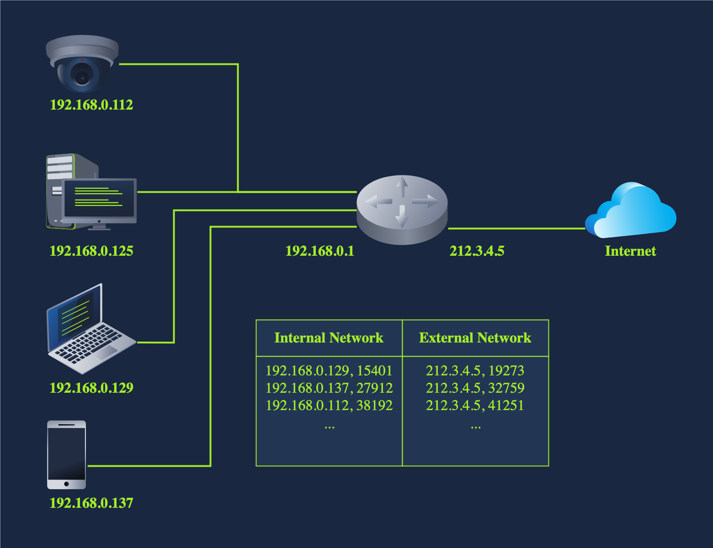

# 🌐 NAT (Network Address Translation)

Como discutido na sala sobre Conceitos de Redes, o IPv4 é capaz de suportar, no máximo, cerca de **quatro bilhões de dispositivos**. Com o crescimento explosivo de equipamentos conectados à Internet — desde computadores e smartphones até câmeras de segurança e até mesmo máquinas de lavar — ficou claro que o espaço de endereços IPv4 seria rapidamente esgotado.

*️⃣ *O IPv4, apesar de parecer “grande”, não foi projetado para um mundo onde literalmente tudo está online. Por isso, surgiu a necessidade de soluções criativas.*

---

## 🔄 NAT: A solução para o esgotamento de IPs

Uma das soluções para esse problema é o **Network Address Translation (NAT)** — ou Tradução de Endereços de Rede.

A ideia por trás do NAT é permitir que **vários dispositivos com endereços IP privados** compartilhem **um único endereço IP público** para acessar a Internet.

*️⃣ *Em vez de precisar de um IP público para cada computador, o NAT permite que muitos compartilhem um só — o que é ótimo para empresas, residências e provedores.*

Por exemplo, imagine uma empresa com **vinte computadores**. Em vez de usar vinte IPs públicos (que são escassos), ela pode usar **um único IP público** para todos esses computadores.

> 🔍 Nota técnica: O número de IPs é sempre expresso como potência de dois. Tecnicamente, usando NAT, você pode reservar **dois IPs públicos** em vez de **trinta e dois**, economizando **trinta IPs** públicos.

*️⃣ *Isso mostra como o NAT ajuda a economizar recursos da Internet. Não só facilita a gestão, como também retarda o esgotamento dos IPs públicos.*

---

## 🧠 Como o NAT funciona?

Diferente do roteamento tradicional (que simplesmente encaminha pacotes), um roteador com suporte a NAT precisa **acompanhar todas as conexões ativas**.

Para isso, ele mantém uma **tabela de tradução de endereços**, que associa IPs e portas internas aos IPs e portas externas.

*️⃣ *Esse processo acontece de forma transparente para o usuário. Mas por trás, o roteador está fazendo mágica: traduzindo endereços o tempo todo.*

---

## 📊 Exemplo prático de tradução

Imagine um laptop dentro da rede local tentando acessar um site:

- O laptop envia uma requisição com **IP interno** `192.168.0.129` e **porta de origem** TCP `15401`.
- O roteador NAT converte esse pacote para usar o **IP público** `212.3.4.5` e **porta externa** TCP `19273`.
- O servidor web, na Internet, vê a requisição como vinda de `212.3.4.5:19273`.

A **tabela NAT** no roteador manterá esse mapeamento enquanto a conexão estiver ativa, garantindo que a resposta do servidor volte corretamente para o laptop.

*️⃣ *O laptop "acha" que está se comunicando diretamente com o site. O servidor web "acha" que está se comunicando diretamente com o IP público. Mas o roteador está no meio dos dois, cuidando da troca de identidade.*

---

## ✅ Resumo

- O **NAT economiza IPs públicos** permitindo que vários dispositivos compartilhem um só.
- Funciona com uma **tabela de tradução de IPs e portas** mantida no roteador.
- É amplamente usado em **residências, empresas** e por **provedores de Internet**.
- Resolve parte do problema do esgotamento de endereços no IPv4.

