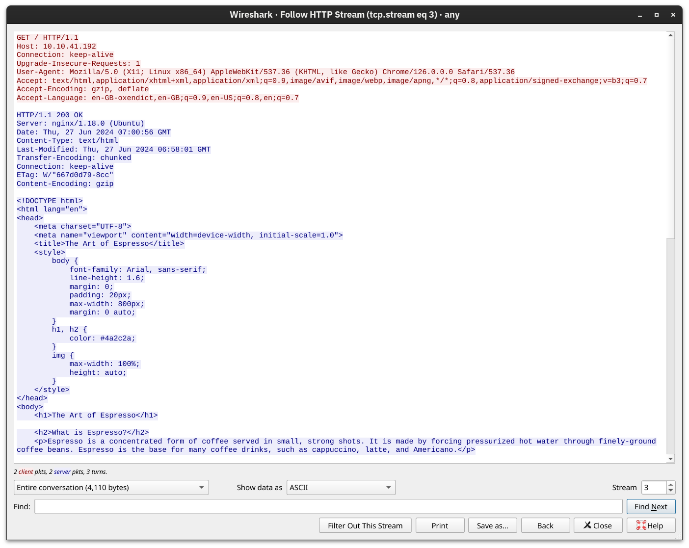

# Protocolos HTTP e HTTPS

Quando você abre o navegador, você utiliza principalmente os protocolos **HTTP** e **HTTPS**.  
HTTP significa **Hypertext Transfer Protocol** (Protocolo de Transferência de Hipertexto), enquanto o "S" em HTTPS indica que a conexão é **Secure** (Segura).

Esse protocolo funciona sobre o **TCP** e define como o seu navegador se comunica com os servidores web.

---

## Métodos HTTP mais comuns

Alguns dos **comandos (ou métodos)** que o seu navegador envia para o servidor web são:

- **GET:** Recupera dados do servidor, como uma página HTML ou uma imagem.
- **POST:** Envia novos dados para o servidor, como ao enviar um formulário ou fazer upload de um arquivo.
- **PUT:** Cria um novo recurso no servidor ou atualiza/substitui um recurso existente.
- **DELETE:** Como o nome sugere, é usado para **excluir** um arquivo ou recurso especificado no servidor.

> 🧠 **Comentário:** GET e POST são os métodos mais comuns na navegação do dia a dia, mas PUT e DELETE são amplamente usados em APIs e aplicações web interativas.

---

## Portas Utilizadas

- **HTTP** normalmente usa a **porta TCP 80**
- **HTTPS** usa a **porta TCP 443**
- Portas menos comuns incluem **8080** (geralmente para HTTP alternativo) e **8443** (HTTPS alternativo)

> 🔒 **Comentário:** HTTPS é essencial para garantir segurança e privacidade, pois criptografa os dados transmitidos entre o navegador e o servidor.

---

## Exemplo prático com o navegador

No exemplo a seguir, utilizamos o navegador **Firefox** para acessar o servidor web no IP `10.10.179.236`.

O navegador recupera a página web e a exibe normalmente. No entanto, nosso foco aqui é **entender o que acontece nos bastidores** — ou seja, os pacotes trocados, os métodos utilizados e como o conteúdo é solicitado e carregado.

> 🧪 **Comentário:** Ferramentas como os painéis de desenvolvedor dos navegadores (F12) e programas como Wireshark permitem visualizar essas interações em detalhes — algo crucial para quem está aprendendo sobre redes e segurança web.

## Analisando HTTP com o Wireshark

Utilizando o **Wireshark**, podemos examinar com mais detalhes a comunicação entre o navegador **Firefox** e o servidor web.

A captura de tela abaixo do Wireshark mostra:

- O **texto enviado pelo navegador** (em vermelho)
- A **resposta do servidor web** (em azul)

 
> 🧠 **Comentário:** Embora o usuário final só veja o conteúdo da página, muitos dados técnicos são trocados entre cliente e servidor que **não aparecem na interface do usuário**. Exemplos:
> - Versão do servidor web (como Apache/2.4.51)
> - Data da última modificação da página
> - Tipo de conteúdo (HTML, JSON, etc.)
> - Encodings suportados
> - Cabeçalhos HTTP

Essas informações podem ser úteis para **diagnóstico**, **testes de segurança** ou para entender melhor como a aplicação web funciona.

---

## Simulando uma Requisição com Telnet

Como vimos no módulo *Networking Concepts*, podemos utilizar o cliente `telnet` para se conectar diretamente ao servidor web executando no IP `10.10.179.236` na porta **80** (HTTP).

Para isso, enviamos manualmente os seguintes comandos:
GET / HTTP/1.1 
Host: anything 

Isso simula uma requisição HTTP feita pelo navegador.

> 🧪 **Comentário:** Em alguns servidores, o segundo cabeçalho `Host: anything` não é obrigatório, mas a maioria exige esse campo para identificar qual site (ou "virtual host") está sendo solicitado — principalmente quando o mesmo servidor hospeda múltiplos sites.

---

### Acessando outros arquivos

Você também pode requisitar arquivos específicos além da página padrão `/`. Por exemplo, para acessar `file.html`, você pode enviar:

GET /file.html HTTP/1.1 
Host: anything 

> 🛠️ **Comentário técnico:** Esse tipo de requisição "manual" é **muito útil para testes e diagnósticos**, pois permite ver exatamente como o servidor responde — sem precisar de navegador, plugins ou ferramentas gráficas.  
> Você está, literalmente, **"falando HTTP" diretamente com o servidor**.
