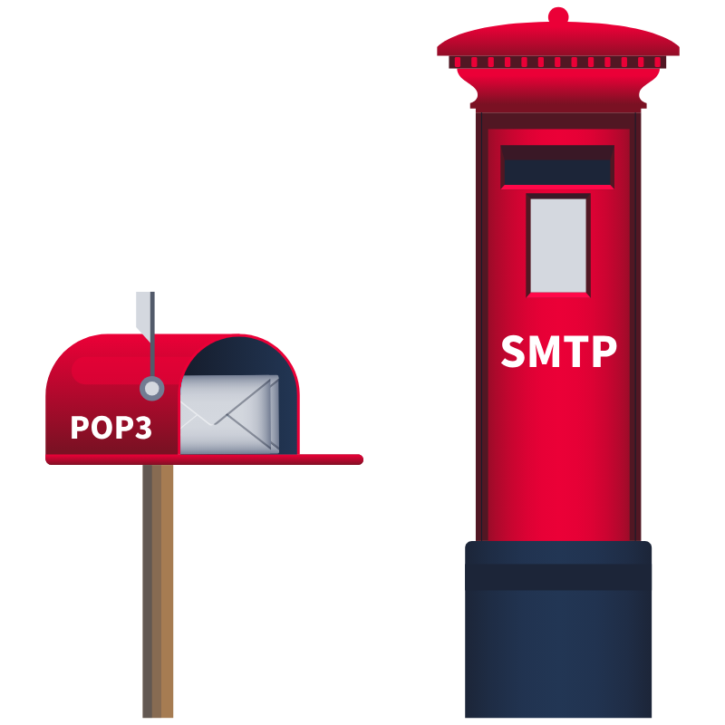

# 📥 Recebendo E-mails com POP3 e Telnet

Depois de enviar um e-mail, você provavelmente quer acessá-lo no seu cliente local de e-mails. Para isso, é usado o **POP3** — *Post Office Protocol version 3*, um protocolo que permite que o cliente de e-mail se conecte a um servidor e **recupere mensagens**.

---

## ✉️ SMTP vs POP3: Qual a Diferença?

Sem entrar nos detalhes técnicos mais profundos:

- **SMTP**: envia mensagens → como **entregar uma carta no correio**.
- **POP3**: baixa mensagens → como **abrir sua caixa de correio pessoal**.

> 💬 Pense assim:
> - **SMTP** = caixa de coleta dos Correios.
> - **POP3** = sua caixinha de cartas na frente de casa.

## 🔧 Comandos POP3 mais usados

Estes são alguns dos comandos mais comuns em uma sessão POP3:

- `USER <username>` → identifica o usuário
- `PASS <password>` → fornece a senha do usuário
- `STAT` → retorna número total de mensagens e tamanho
- `LIST` → lista todas as mensagens e seus tamanhos
- `RETR <número>` → recupera a mensagem especificada
- `DELE <número>` → marca a mensagem para exclusão
- `QUIT` → encerra a sessão e aplica alterações (como deleções)

---

## 🧪 Exemplo: Sessão POP3 com Telnet

POP3 usa a porta TCP **110** por padrão. No exemplo abaixo, é usada uma conexão `telnet` para recuperar a mensagem enviada no exemplo anterior.

### Terminal
user@TryHackMe$ telnet 10.10.253.240 110 
Trying 10.10.253.240... 
Connected to 10.10.253.240. 
Escape character is '^]'. 
+OK [XCLIENT] Dovecot (Ubuntu) ready. 
AUTH 
+OK 
PLAIN 
. 
USER strategos 
+OK 
PASS  
+OK Logged in. 
STAT 
+OK 3 1264 
LIST 
+OK 3 messages: 
1 407 
2 412 
3 445 
. 
RETR 3 
+OK 445 octets 
Return-path: user@client.thm 
Envelope-to: strategos@server.thm 
Delivery-date: Thu, 27 Jun 2024 16:19:35 +0000 
Received: from [10.11.81.126] (helo=client.thm) 
    by example.thm with smtp (Exim 4.95) 
    (envelope-from user@client.thm) 
    id 1sMrpq-0001Ah-UT 
    for strategos@server.thm; 
    Thu, 27 Jun 2024 16:19:35 +0000 
From: user@client.thm 
To: strategos@server.thm 
Subject: Telnet email 
 
Hello. I am using telnet to send you an email! 
. 
QUIT 
+OK Logging out. 
Connection closed by foreign host. 

---

## 🔐 Segurança: Alerta Importante!

> ⚠️ **As comunicações POP3 acontecem em texto puro por padrão**.

Isso significa que qualquer pessoa monitorando a rede (com ferramentas como Wireshark) pode **ver senhas e conteúdo de mensagens**, como mostra a imagem abaixo:

As capturas do Wireshark distinguem:
- **Comandos do cliente** → em vermelho
- **Respostas do servidor** → em azul

---

## 🔑 Credenciais de Acesso (quando necessário)

Ao se conectar a um servidor POP3, é necessário autenticar-se. Use as seguintes credenciais:

- **Usuário:** `linda`
- **Senha:** `Pa$$123`

---

## 🧠 Conclusão

POP3 é um protocolo simples e direto para baixar mensagens de e-mail. Apesar de ser eficiente, **não é seguro sem criptografia**. Sempre prefira conexões **POP3S (POP3 sobre SSL/TLS)** em ambientes reais.
