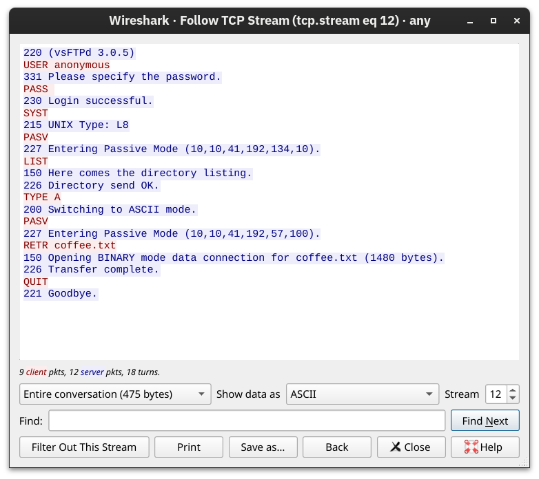

# Protocolo de Transferência de Arquivos (FTP)

Diferente do HTTP, que é projetado para recuperar páginas da web, o **FTP (File Transfer Protocol)** é projetado especificamente para transferir arquivos. Por isso, o FTP é muito eficiente nesse tipo de tarefa e, quando todas as condições são iguais, pode atingir velocidades mais altas do que o HTTP.

## Comandos comuns do protocolo FTP:

- `USER`: usado para inserir o nome de usuário.
- `PASS`: usado para digitar a senha.
- `RETR`: (retrieve) utilizado para **baixar** um arquivo do servidor FTP para o cliente.
- `STOR`: (store) utilizado para **enviar** um arquivo do cliente para o servidor FTP.

O servidor FTP escuta, por padrão, na **porta TCP 21**. A transferência de dados é feita através de **outra conexão separada** iniciada pelo cliente com o servidor.

---

## Exemplo de uso no terminal

No terminal abaixo, executamos o comando `ftp 10.10.253.240` para conectar a um servidor FTP remoto usando o cliente local FTP. Em seguida, seguimos os seguintes passos:

1. Utilizamos o nome de usuário `anonymous` para logar.
2. Não foi necessário fornecer senha.
3. Usamos o comando `ls` para listar os arquivos disponíveis para download.
4. Usamos `type ascii` para mudar para o modo ASCII (já que é um arquivo de texto).
5. Por fim, usamos `get coffee.txt` para baixar o arquivo desejado.

### Terminal
user@TryHackMe$ ftp 10.10.253.240 
Connected to 10.10.253.240 (10.10.253.240). 
220 (vsFTPd 3.0.5) 
Name (10.10.253.240:strategos): anonymous 
331 Please specify the password. 
Password: 
230 Login successful. 
Remote system type is UNIX. 
Using binary mode to transfer files. 
ftp> ls 
227 Entering Passive Mode (10,10,41,192,134,10). 
150 Here comes the directory listing. 
-rw-r--r-- 1 0 0 1480 Jun 27 08:03 coffee.txt 
-rw-r--r-- 1 0 0 14 Jun 27 08:04 flag.txt 
-rw-r--r-- 1 0 0 1595 Jun 27 08:05 tea.txt 
226 Directory send OK. 
ftp> type ascii 
200 Switching to ASCII mode. 
ftp> get coffee.txt 
local: coffee.txt remote: coffee.txt 
227 Entering Passive Mode (10,10,41,192,57,100). 
150 Opening BINARY mode data connection for coffee.txt (1480 bytes). 
WARNING! 47 bare linefeeds received in ASCII mode 
File may not have transferred correctly. 
226 Transfer complete. 
1480 bytes received in 8e-05 secs (18500.00 Kbytes/sec) 
ftp> quit 
221 Goodbye. 

> ⚠️ **Nota:** o modo ASCII pode causar problemas com arquivos que não estejam formatados como texto simples. A mensagem de *WARNING* indica isso.

---

## Análise com o Wireshark

Usamos o **Wireshark** para examinar mais de perto as mensagens trocadas entre cliente e servidor. As mensagens enviadas pelo **cliente** aparecem em **vermelho**, e as respostas do **servidor** em **azul**.

Note que os comandos digitados pelo usuário nem sempre são enviados ao servidor com o mesmo nome. Por exemplo, ao digitar `ls`, o cliente envia o comando `LIST` ao servidor.

Outro detalhe importante: **tanto a listagem de diretório quanto o arquivo baixado são transferidos por conexões separadas**, distintas da conexão principal de controle (porta 21).

